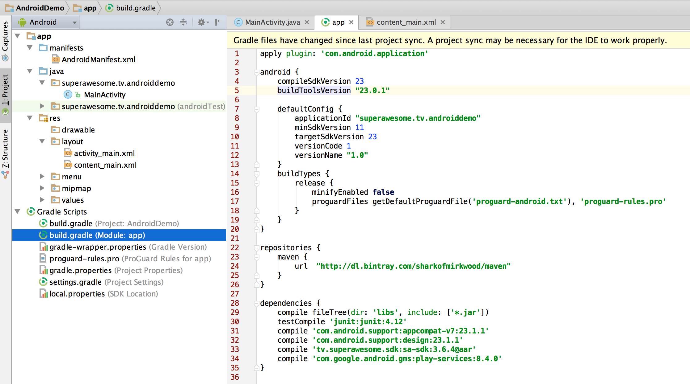
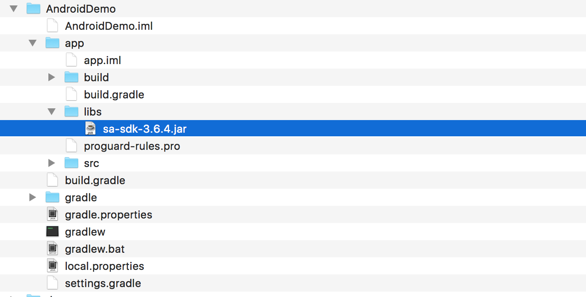
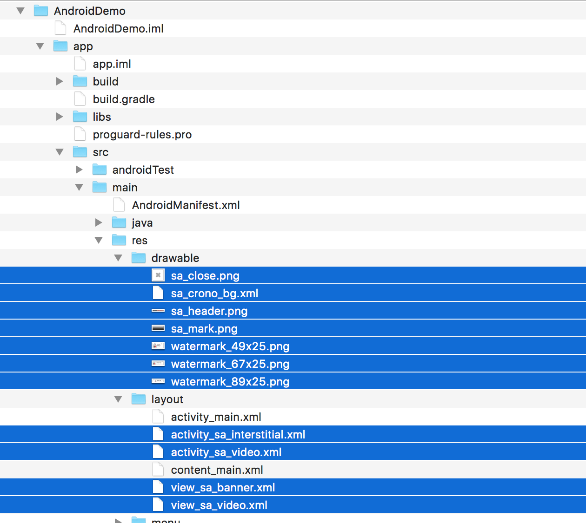
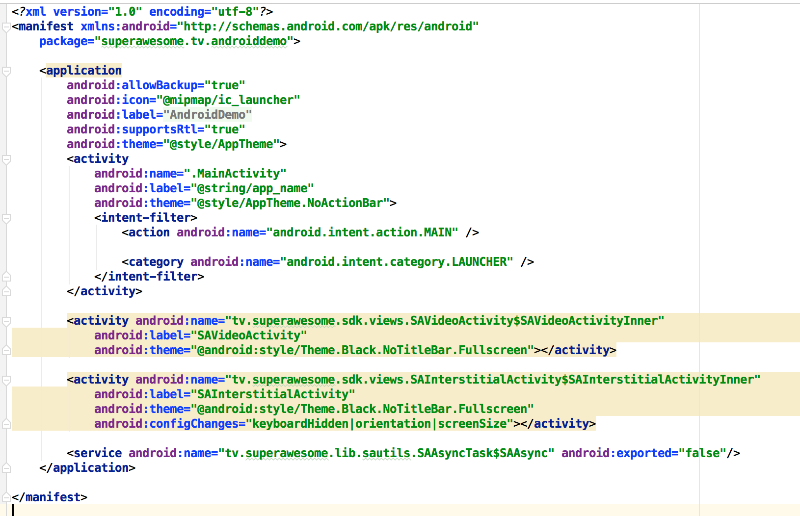

Integrate the SDK
=================

**Note**: This document assumes:

* an Android Studio project called **AndroidDemo**
* containing a single activity called **MainActivity**
* and a manifest file called **AndroidManifest**

Add the SDK through Gradle
^^^^^^^^^^^^^^^^^^^^^^^^^^

The simplest way of installing the AwesomeAds SDK in Android Studio is to download the AAR library through Gradle.

Just include the following in your module's **build.gradle** file (usually the file under MyApplication/app/):

.. code-block:: shell

    repositories {
        maven {
            url  "http://dl.bintray.com/sharkofmirkwood/maven"
        }
    }

    dependencies {
        // required
        compile 'tv.superawesome.sdk:sa-sdk:<sdk_version_android>'

        // optional - for MOAT integration
        compile 'tv.superawesome.sdk:samoat:<sdk_version_android>'

        // optional - for Google Play Integration
        compile 'com.google.android.gms:play-services:8.4.0'
    }

Add the SDK as a JAR library
^^^^^^^^^^^^^^^^^^^^^^^^^^^^

If you're running an environment which does not support Gradle, then you'll need to add the SDK manually.

1) Download `sa-sdk-<sdk_version_android>.jar <https://github.com/SuperAwesomeLTD/sa-mobile-sdk-android-docs/raw/master/source/res/sa-sdk-<sdk_version_android>.jar>`_

You'll need to add it to your project's **lib** folder, usually **AndroidDemo/app/libs**.
The libs folder should be located on the same level as the **src** and **build** folders.
Once it's there, in Android Studio you'll need to select it, right-click it and then **Add as Library**.

2) Download `sa-sdk-res.zip <https://github.com/SuperAwesomeLTD/sa-mobile-sdk-android-docs/raw/master/source/res/sa-sdk-res.zip>`_ and unzip it.

You'll find two folders inside:

* drawable: containing a bunch of PNG files; copy the PNG files inside your projects' **drawable** folder
* layout: containing a buch of XML files; copy the XML files inside your projects' **layout** folder

3) Add the following items in your AndroidManifest file, under the Application tag:

.. code-block:: xml

    <activity android:name="tv.superawesome.sdk.views.SAFullscreenVideoAd$SAFullscreenVideoAdActivity"
              android:label="SAFullscreenVideoAd"
              android:theme="@android:style/Theme.Black.NoTitleBar.Fullscreen"></activity>

    <activity android:name="tv.superawesome.sdk.views.SAInterstitialAd$SAInterstitialAdActivity"
              android:label="SAInterstitialAd"
              android:theme="@android:style/Theme.Black.NoTitleBar.Fullscreen"
              android:configChanges="keyboardHidden|orientation|screenSize"></activity>

    <service android:name="tv.superawesome.lib.sautils.SAAsyncTask$SAAsync" android:exported="false"/>

This will register two new activities and one service for your application, all needed by the SDK.

4) At the end you'll also need to add Google Play Services as a dependency to the project, either as a JAR or through Gradle.

Finish up
^^^^^^^^^

The last two thing to do, whether you've added the SuperAwesome SDK through Gradle or the Jar archive is to setup some permissions in the
AndroidManifest file.

The first is access to Internet:

.. code-block:: xml

    <uses-permission android:name="android.permission.INTERNET"/>

and the second, for read/write from the external disk, to take advantage of the SDKs pre-loading and caching of video data:

.. code-block:: xml

    <uses-permission android:name="android.permission.READ_EXTERNAL_STORAGE" />
    <uses-permission android:name="android.permission.WRITE_EXTERNAL_STORAGE" />

If you don't add the last two permissions, video ads will be buffered in memory at run-time.

Also, for Android M (6.0) onwards besides adding permissions to the manifest file, you'll need to handle them at run time.

.. code-block:: java

    private final int MY_PERMISSIONS_REQUEST_RESULT = 0;

    // rest of implementation ...

    if (ContextCompat.checkSelfPermission(
        MainActivity.this,
        Manifest.permission.READ_EXTERNAL_STORAGE) != PackageManager.PERMISSION_GRANTED)
    {

        // Should we show an explanation?
        if (ActivityCompat.shouldShowRequestPermissionRationale(
            MainActivity.this,
            Manifest.permission.READ_EXTERNAL_STORAGE)) {

            // show some message
        }
        else {

            // request permission
            ActivityCompat.requestPermissions(MainActivity.this,
                new String[]{ Manifest.permission.READ_EXTERNAL_STORAGE },
                MY_PERMISSIONS_REQUEST_READ_CONTACTS);
        }
    }

    @Override
    public void onRequestPermissionsResult(int requestCode,
                                           String permissions[], int[] grantResults) {
        switch (requestCode) {
            case MY_PERMISSIONS_REQUEST_RESULT: {
                // If request is cancelled, the result arrays are empty.
                if (grantResults.length > 0 &&
                    grantResults[0] == PackageManager.PERMISSION_GRANTED) {
                    // permission granted
                } else {
                    // permission denied
                }
                return;
            }
        }
    }
