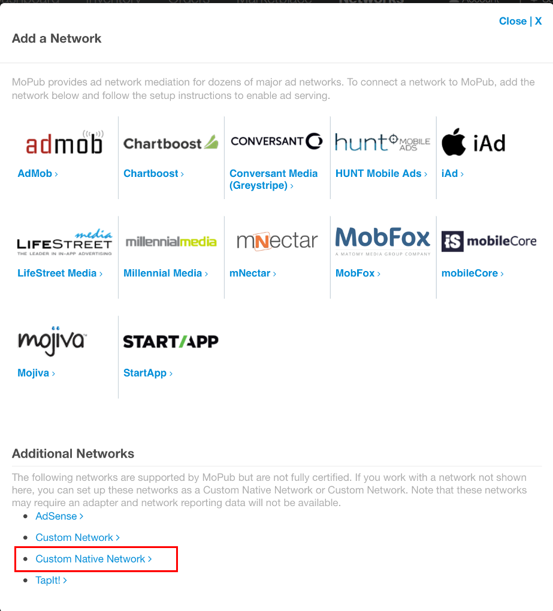
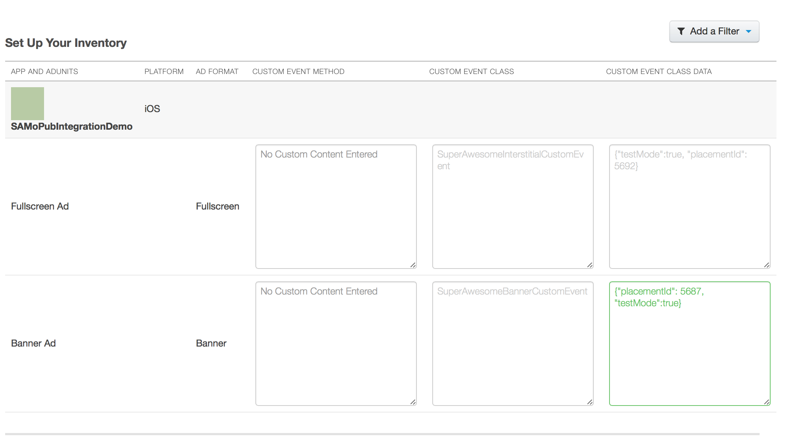

Integrate with MoPub
====================

If you already have MoPub ads serving in your app, but want to integrate SuperAwesome as well,
without having to directly use the AwesomeAds SDK, you can follow the steps below:

1) Add the SuperAwesome MoPub adapters to your app:

You can either change your module's **build.gradle** file (usually the file under MyApplication/app/) to
the following format:

.. code-block:: shell

    repositories {
        maven {
            url  "http://dl.bintray.com/gabrielcoman/maven"
        }
    }

    dependencies {
        # add SuperAwesome SDK
        compile 'tv.superawesome.sdk:superawesome:<sdk_version_android>'
        # or add the base SDK
        # compile 'tv.superawesome.sdk:superawesome-base:<sdk_version_android>'

        # add MoPub plugin
        compile 'tv.superawesome.sdk:samopub:<sdk_version_android>'
    }

You can also download the MoPub adatper as a .jar archive, from here `SuperAwesomeSDK-<sdk_version_android>.Android.MoPubPlugin.jars.zip <https://github.com/SuperAwesomeLTD/sa-sdk-build-repo/blob/master/package/SuperAwesomeSDK-<sdk_version_android>.Android.MoPubPlugin.jars.zip?raw=true>`_.

The MoPub plugin will contain three main classes that conform to MoPub's guidelines regarding 3rd party ad network adapters:

  * `SuperAwesomeBannerCustomEvent.java <https://raw.githubusercontent.com/SuperAwesomeLTD/sa-mobile-sdk-android/master/demo/samopub/src/main/java/com/mopub/sa/mobileads/SuperAwesomeBannerCustomEvent.java>`_
  * `SuperAwesomeInterstitialCustomEvent.java <https://raw.githubusercontent.com/SuperAwesomeLTD/sa-mobile-sdk-android/master/demo/samopub/src/main/java/com/mopub/sa/mobileads/SuperAwesomeInterstitialCustomEvent.java>`_
  * `SuperAwesomeRewardedVideoCustomEvent.java <https://raw.githubusercontent.com/SuperAwesomeLTD/sa-mobile-sdk-android/master/demo/samopub/src/main/java/com/mopub/sa/mobileads/SuperAwesomeRewardedVideoCustomEvent.java>`_

2) Setup a MoPub custom network

From your MoPub admin interface you should create a `New Network`

.. image:: img/IMG_07_MoPub_1.png

From the next menu, select `Custom Native Network`

You'll be taken to a new page. Here select the title of the new network

.. image:: img/IMG_07_MoPub_3.png

And assign custom inventory details for Banner, Interstitial and Video ads:

3) Assign custom event classes for your MoPub ads:

There are

* for Banner Ads: **com.mopub.sa.mobileads.SuperAwesomeBannerCustomEvent**
* for Interstitial Ads: **com.mopub.sa.mobileads.SuperAwesomeInterstitialCustomEvent**
* for Rewarded Video Ads: **com.mopub.sa.mobileads.SuperAwesomeRewardedVideoCustomEvent**

Notice these are identical to the names of the files you downloaded in step one.

4) Assign custom event data as JSON:

.. code-block:: shell

    {
    	"placementId": 5692,
    	"isTestEnabled": true,
    	"isParentalGateEnabled": true,
        // only for video
        "shouldShowCloseButton": false,
        "shouldAutomaticallyCloseAtEnd": true,
        "shouldLockOrientation": true,
        "lockOrientation": "LANDSCAPE" or "PORTRAIT"
    }
