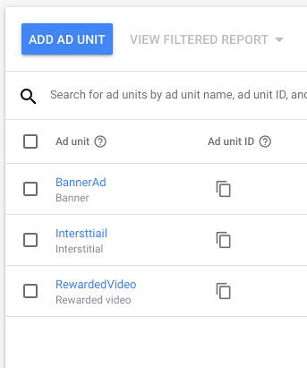
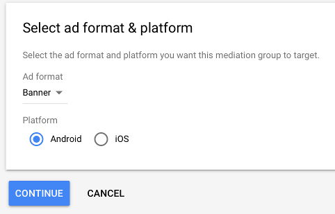
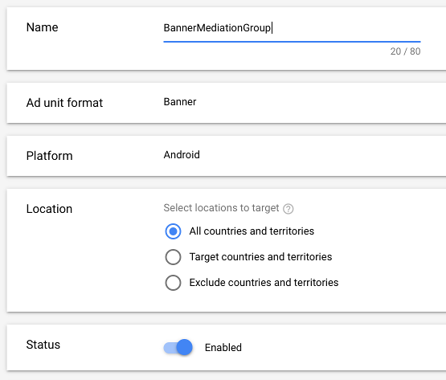
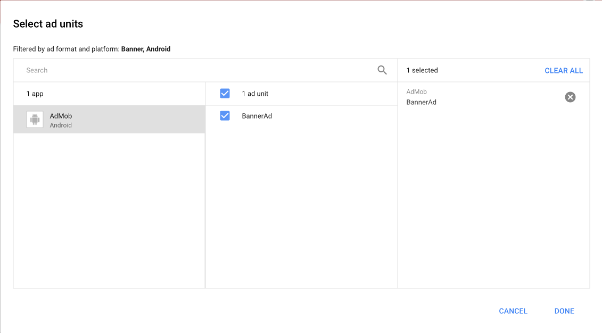
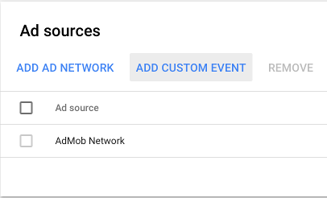
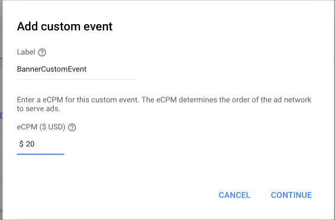
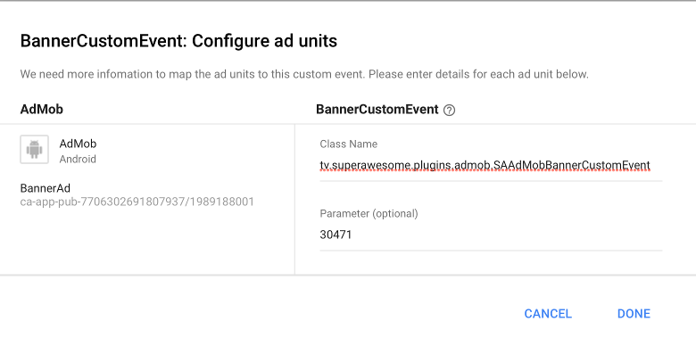

Integrate with AdMob
====================

If you already have AdMob ads serving in your app, but want to integrate SuperAwesome as well,
without having to directly use the AwesomeAds SDK, you can follow the steps below:

Add the AdMob plugin
--------------------

You can either change your module's **build.gradle** file (usually the file under MyApplication/app/) to
the following format:

.. code-block:: shell

    repositories {
        maven {
            url  "http://dl.bintray.com/gabrielcoman/maven"
        }
    }

    dependencies {
        # add SuperAwesome SDK
        compile 'tv.superawesome.sdk:superawesome:<sdk_version>'
        # or add the base SDK
        # compile 'tv.superawesome.sdk:superawesome-base:<sdk_version>'

        # add MoPub plugin
        compile 'tv.superawesome.sdk:saadmob:<sdk_version>'
    }

The AdMob plugin will contain three main classes that conform to AdMob's guidelines regarding 3rd party ad network adapters:

* `SAAdMobBannerCustomEvent <https://github.com/SuperAwesomeLTD/sa-mobile-sdk-android/blob/master/saadmob/src/main/java/tv/superawesome/plugins/admob/SAAdMobBannerCustomEvent.java>`_
* `SAAdMobInterstitialCustomEvent <https://github.com/SuperAwesomeLTD/sa-mobile-sdk-android/blob/master/saadmob/src/main/java/tv/superawesome/plugins/admob/SAAdMobInterstitialCustomEvent.java>`_
* `SAAdMobVideoMediationAdapter <https://github.com/SuperAwesomeLTD/sa-mobile-sdk-android/blob/master/saadmob/src/main/java/tv/superawesome/plugins/admob/SAAdMobVideoMediationAdapter.java>`_

You can also download the AdMob adapter as a .jar archive, from here `SuperAwesomeSDK-<sdk_version>.Android.AdMobPlugin.zip <https://github.com/SuperAwesomeLTD/sa-sdk-build-repo/blob/master/package/aa_android/<sdk_version>/SuperAwesomeSDK-<sdk_version>.Android.AdMobPlugin.jars.zip?raw=true>`_.

Setup AdMob Mediation Groups
----------------------------

Login to the AdMob dashboard using your preferred account.

From here forward the tutorial assumes you have an Android app with three ad units setup in AdMob; one banner, one interstitial ad and one rewarded video ad:

Then, in the **Mediation** menu, create a new Mediation Group:

Next, fill in the necessary details:

and add your app's banner **Ad Unit** as target:

Then, in the **Ad Sources** panel, add a new **Custom Event**:

and, as well, customise it:

and finally set the AwesomeAds custom event class name as Class Name **tv.superawesome.plugins.admob.SAAdMobBannerCustomEvent** and the parameter as your **Placement ID**:

Finally, save your changes. This will register **BannerCustomEvent** as a custom event running on your ad units from now on.
You'll have to repeat the same process for interstitial and rewarded video ads.

Implement AdMob ads in your Android app
---------------------------------------

Once the previous steps are done, you can add AdMob banners, interstitials and rewarded video ads just as you normally would:

.. code-block:: java

    // initialise app
	  MobileAds.initialize(this, "__YOUR_APP_ID__");

    // add a new banner
    AdView adView = (AdView) findViewById(R.id.AdViewID);
    adView.loadAd(new AdRequest.Builder().build());

    // add a new interstitial
    InterstitialAd mInterstitialAd = new InterstitialAd(this);
    mInterstitialAd.setAdUnitId("__YOUR_AD_ID__");
    mInterstitialAd.loadAd(new AdRequest.Builder().build());

    // add a new video
    RewardedVideoAd mAd = MobileAds.getRewardedVideoAdInstance(this);
    mAd.loadAd("__YOUR_AD_ID__", new AdRequest.Builder().build());

Since the previously created custom events will run on these ads, and AwesomeAds is integrated alongside the AdMob plugin, you
should start seeing ads playing.

Customise the experience
------------------------

Additionally, you can customise the experience of each ad unit.

1) For banners:

.. code-block:: objective-c

    // build a new Bundle full of extra data
    Bundle extras1 = SAAdMobExtras.extras()
        .setTestMode(false)
        .setParentalGate(false)
        .setTransparent(true)
        .build();

    // register that bundle as an extra when creating the request
    adView.loadAd(new AdRequest
        .Builder()
        .addCustomEventExtrasBundle(SAAdMobBannerCustomEvent.class, extras1)
        .build());

2) For interstitials:

.. code-block:: objective-c

    // build a new Bundle full of extra data
   Bundle extras2 = SAAdMobExtras.extras()
        .setTestMode(false)
        .setOrientation(SAOrientation.PORTRAIT)
        .setParentalGate(true)
        .build();

    // register that bundle as an extra when creating the request
    mInterstitialAd.loadAd(new AdRequest
        .Builder()
        .addCustomEventExtrasBundle(SAAdMobInterstitialCustomEvent.class, extras2)
        .build());

3) For rewarded video:

.. code-block:: objective-c

    // build a new Bundle full of extra data
    Bundle extras3 = SAAdMobExtras.extras()
          .setTestMode(false)
          .setParentalGate(false)
          .setOrientation(SAOrientation.LANDSCAPE)
          .setSmallClick(true)
          .setCloseAtEnd(true)
          .setCloseButton(true)
          .build();

    // register that bundle as an extra when creating the request
   mAd.loadAd("__YOUR_AD_ID__", new AdRequest
          .Builder()
          .addNetworkExtrasBundle(SAAdMobVideoMediationAdapter.class, extras3)
          .build());

These parameters will be passed by the AdMob SDK to the AwesomeAds Plugin so that ads will display the way you want them to.
