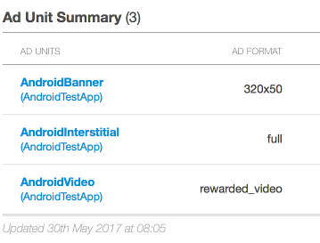
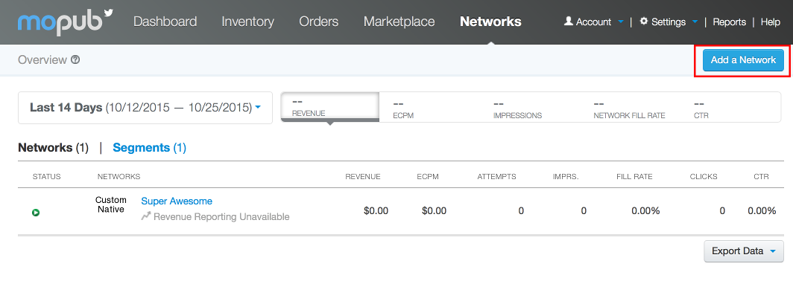
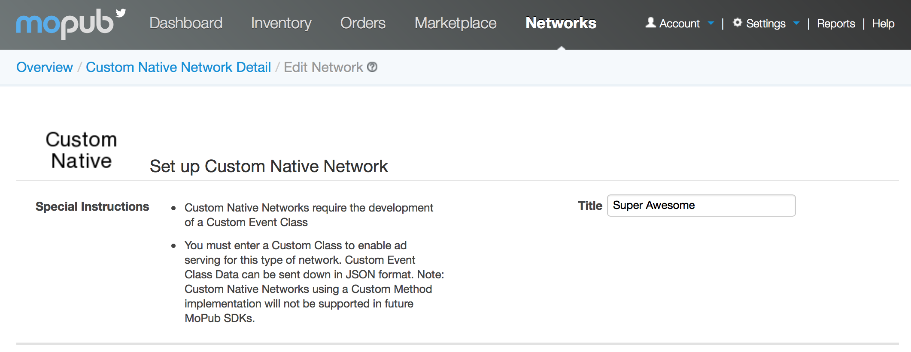
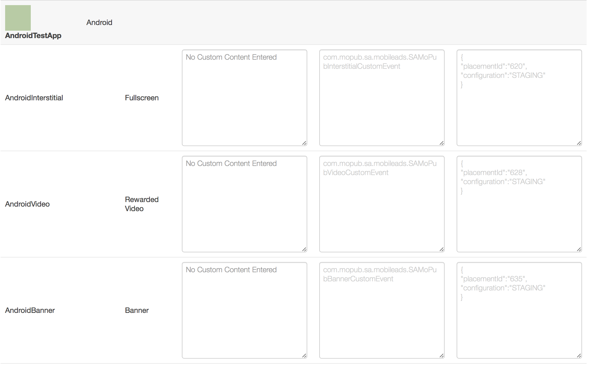

Integrate with MoPub
====================

If you already have MoPub ads serving in your app, but want to integrate AwesomeAds as well,
without having to directly use the Android Publisher SDK, you can follow the steps below:

Add the MoPub plugin
--------------------

You can either change your module's **build.gradle** file (usually the file under MyApplication/app/) to
the following format:

.. code-block:: shell

    repositories {
        maven {
            url  "http://dl.bintray.com/gabrielcoman/maven"
        }
    }

    dependencies {
        # add the Android Publisher SDK
        compile 'tv.superawesome.sdk.publisher:superawesome:<sdk_version>'

        # add MoPub plugin
        compile 'tv.superawesome.sdk.publisher:samopub:<sdk_version>'
    }

You can also download the MoPub adapter as a .jar archive, from here `SuperAwesomeSDK-<sdk_version>.Android.MoPubPlugin.jars.zip <https://github.com/SuperAwesomeLTD/sa-sdk-build-repo/blob/master/package/aa_android/<sdk_version>/SuperAwesomeSDK-<sdk_version>.Android.MoPubPlugin.jars.zip?raw=true>`_.

Setup MoPub Custom Networks
---------------------------

Login to the MoPub dashboard using your preferred account.

From here forward the tutorial assumes you have an Android app with three ad units setup in MoPub; one banner, one interstitial ad and one rewarded video ad:

From your MoPub admin interface you should create a **New Network**

From the next menu, select **Custom Native Network**

.. image:: img/IMG_07_MoPub_2.png

You'll be taken to a new page. Here select the title of the new network

And assign custom inventory details for Banner, Interstitial and Video ads:

Notice that the custom event classes required by MoPub are:

* for Banner Ads: **tv.superawesome.plugins.publisher.mopub.SAMoPubBannerCustomEvent**
* for Interstitial Ads: **tv.superawesome.plugins.publisher.mopub.SAMoPubInterstitialCustomEvent**
* for Rewarded Video Ads: **tv.superawesome.plugins.publisher.mopub.SAMoPubVideoCustomEvent**

Finally, you can tell MoPub what AwesomeAds ads to load and how to display them by filling out the
custom event class data field with a JSON similar to this:

.. code-block:: shell

    {
        "placementId": 30473,
        "isTestEnabled": true or false,
        "isParentalGateEnabled": true or false,
        "orientation": "ANY" or "PORTRAIT" or "LANDSCAPE",
        "shouldShowCloseButton": false or false,
        "shouldAutomaticallyCloseAtEnd": true or false,
        "shouldShowSmallClickButton": true or false
    }

Implement MoPub ads in your Android app
---------------------------------------

Once the previous steps are done, you can add MoPub banners, interstitials and rewarded video ads just as you normally would:

.. code-block:: java

    //
    // create banner ad
    MoPubView banner = (MoPubView) findViewById(R.id.BannerID);
    banner.setAdUnitId("_AD_UNIT_ID_");
    banner.loadAd();

    //
    // create interstitial
    MoPubInterstitial interstitial = new MoPubInterstitial(this, "_AD_UNIT_ID_");
    interstitial.load();

    //
    // create video
    MoPubRewardedVideos.initializeRewardedVideo(this);
    MoPubRewardedVideos.loadRewardedVideo("_AD_UNIT_ID_");

Since the previously created custom events will run on these ads, and the Android Publisher SDK is integrated alongside the MoPub plugin, you
should start seeing ads playing.
